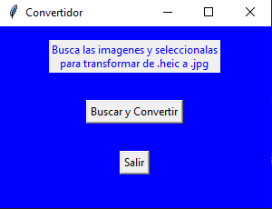

# UI para usar ConvertApi

Una interfaz gráfica para utilizar la API de [ConvertApi](https://www.convertapi.com/) con la finalidad de cambiar el formato de las imágenes más rápido, al permitir seleccionar varios archivos del mismo tipo para convertirlos al deseado. Viene configurado para pasar imagenes ```.heic``` a ```.jpg```

## Requerimientos
Este proyecto fue desarrollado en Python3.10. Incluye un archivo requeriments.txt que contiene las dependencias del repositorio. 

Además debes estar registrado en [https://www.convertapi.com/](https://www.convertapi.com/) para obtener tu llave secreta. Está herramienta esta integrada con Github y Gmail, por lo que puedes acceder a ella en poco tiempo.

## Instalación

1. Clona el repositorio y abre el proyecto con tu editor favorito.

2. Este proyecto usa pipenv. Si no lo tienes te recomiendo usarlo ```pip install pipenv```. 

3. Instala las dependencias con pipenv ```pipenv install```

4. Crea un archivo ```.env``` en el directorio principal y pega las variables que están en el archivo ```.env.example``` o simplemente copia y pega de acá:
```
CONVERT_API_SECRET=secret_api
CONVERT_API_KEY=secret_api_key # not necesary
```
5. Ingresa a tu cuenta [ConvertApi](https://www.convertapi.com/) y copia la "API_SECRET" y reemplazala en el archivo ```.env```

## Uso
1. Activa el entorno virtual con ```pipenv shell```
2. Ejecuta ```pipenv run start```

<p align="center">
  
</p>

Se abre la aplicación. Contiene un botón "Buscar" y otro "Salir". Presiona el primero para navegar hasta la/s imagen/es con extensión ```.heic``` que deseas transformar a ```.jpg```(recuerda que debes seleccionar todas del mismo formato o te dará error).

Una vez hayas seleccionado las imágenes se ejecuta la transformación que puede tardar unos minutos según la cantidad y tamaño de los archivos.
Las imágenes son guardadas en la carpeta "Fotos" del proyecto. ***NOTA: Si no existe la carpeta debes crearla***

Si el proceso finaliza correctamente aparece un mensaje de éxito (y podrás ver las fotos con el formato deseado en la carpeta "fotos"), en caso contrario te indica que algo salió mal e imprime el error en la consola.

## Contacto
- alburquenque.letelier@gmail.com
- +56979577547